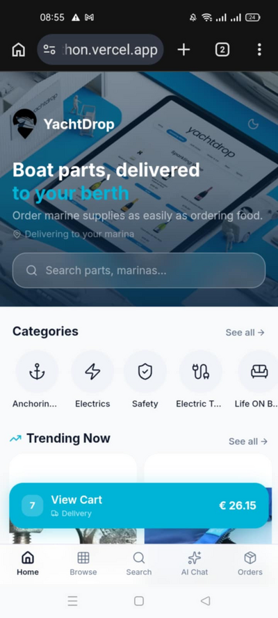
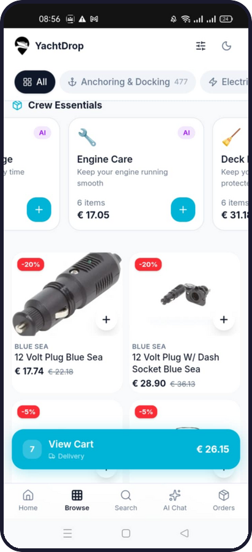
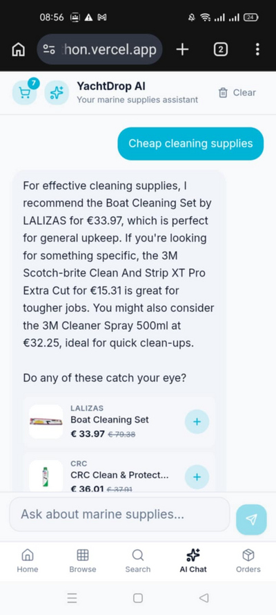
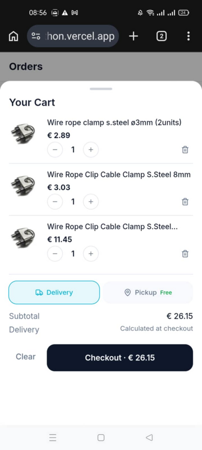
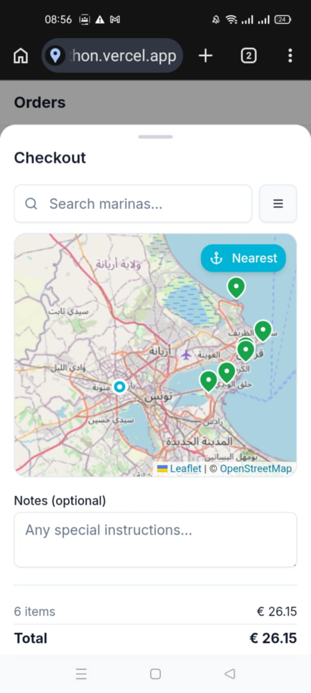
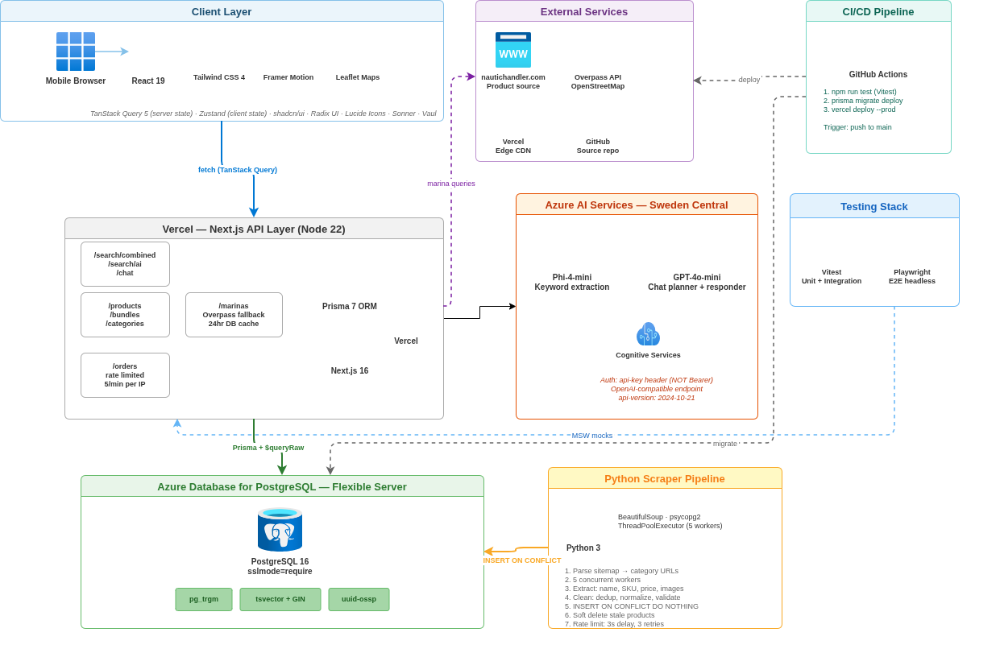

# YachtDrop

<p align="center">
  <strong>Order boat parts as easily as ordering food delivery.</strong>
</p>

<p align="center">
  A mobile-first online chandlery marketplace where yacht crews browse marine supplies, get AI-powered recommendations, and have parts delivered directly to their berth — or pick them up at the nearest marina.
</p>

<p align="center">
  <a href="https://yachtdrop.vercel.app"><strong>Live Demo →</strong></a>
</p>

---

## App Preview

<p align="center">
  
  &nbsp;
  
  &nbsp;
  
</p>

<p align="center">
  
  &nbsp;
  
</p>

---

## About the Project

YachtDrop was built for the **Marine NanoTech Hackathon**. The brief: create a working MVP that pulls live product data from [nautichandler.com](https://nautichandler.com) and delivers an app-like shopping experience entirely in the browser.

**The problem:** Yacht crews need parts fast. They're on deck, one hand free, patchy Wi-Fi, and no time to navigate clunky desktop catalogs.

**The solution:** A PWA that feels like Uber Eats for marine supplies — card-based browsing, AI-powered search, conversational shopping assistant, and marina delivery with an interactive map.

---

## Key Features

| Feature | Description |
|---------|-------------|
| **Live product catalog** | Python scraper ingests 3,000+ products from nautichandler.com with prices, images, and metadata |
| **AI-powered search** | Natural language queries processed by Phi-4-mini to extract keywords, then matched via full-text search + trigram |
| **AI chat assistant** | GPT-4o-mini conversational shopping — ask "what do I need to clean my deck?" and get curated recommendations |
| **Crew Essentials bundles** | Pre-built kits (Engine Care, Deck Maintenance, Safety Kit) for quick provisioning |
| **Marina delivery** | Interactive Leaflet map with OpenStreetMap; search marinas, pick your berth, choose delivery or free pickup |
| **App-like UX** | Bottom nav, slide-in drawers, skeleton loaders, smooth transitions, sticky cart bar |
| **PWA support** | Installable, service worker caching for offline tolerance on patchy marina Wi-Fi |

---

## Architecture

<p align="center">
  
</p>

### Data Flow

```
nautichandler.com ──[Python scraper]──> Azure PostgreSQL (FTS + pg_trgm)
                                              │
                    ┌─────────────────────────┤
                    │                         │
              Vercel (Next.js)          Azure AI Services
              ├─ App Router API         ├─ Phi-4-mini (search)
              ├─ React 19 SSR          └─ GPT-4o-mini (chat)
              └─ Edge caching
                    │
              Mobile browser (PWA)
```

### Search Pipeline

**Keyword search** — short queries like "anchor rope":
```
Input → 300ms debounce → /api/search/combined
  → tsvector AND → OR fallback → ILIKE fallback
  → { products[], marinas[] }
```

**AI search** — natural language like "what do I need for anchoring?":
```
Input → 300ms debounce → /api/search/ai
  → Phi-4-mini keyword extraction → multi-keyword FTS → dedup
  → { products[], marinas[], aiContext }
```

### Chat Pipeline

```
User message → chitchat detection (regex)
  → GPT-4o-mini planner → { queries, categories, priceMax }
  → FTS retrieval → relevance scoring
  → GPT-4o-mini responder (multi-turn history + product context)
  → { message, products[], marinas[] }
```

---

## Tech Stack

| Layer | Technology |
|-------|-----------|
| Frontend | Next.js 16 (App Router), React 19, TypeScript 5 |
| Styling | TailwindCSS 4, Framer Motion 12, Radix UI, shadcn/ui |
| State | TanStack Query 5 (server), Zustand 5 (client) |
| AI | Azure AI Services — Phi-4-mini (search), GPT-4o-mini (chat) |
| Database | PostgreSQL 16 on Azure Flexible Server, Prisma 7, pg_trgm + tsvector FTS |
| Auth | Clerk |
| Maps | Leaflet + OpenStreetMap + Overpass API |
| Scraper | Python 3, BeautifulSoup, ThreadPoolExecutor (5 workers) |
| Testing | Vitest, MSW, Playwright |
| Hosting | Vercel (Edge + Serverless) |
| CI/CD | GitHub Actions → Test → Migrate → Deploy |

---

## Project Structure

```
web/src/
├── app/
│   ├── api/
│   │   ├── search/combined/   # Combined product + marina FTS
│   │   ├── search/ai/         # NL → Phi-4-mini → keywords → FTS
│   │   ├── chat/              # Two-model conversational AI
│   │   ├── bundles/           # AI crew essentials bundles
│   │   ├── marinas/           # Marina DB + Overpass fallback (24hr cache)
│   │   ├── products/          # CRUD, /trending, /offers
│   │   ├── orders/            # Order creation (5/min rate limit)
│   │   └── categories/        # Category list with counts
│   ├── browse/                # Catalog with category tabs
│   ├── search/                # Search with filters
│   ├── chat/                  # AI assistant
│   ├── product/[id]/          # Product detail
│   └── orders/                # Order history
├── components/
│   ├── search/                # SearchBar, SearchResults, Autosuggest
│   ├── product/               # ProductCard, ProductRow, BundleCard
│   ├── cart/                  # CartBar, CartDrawer, CartItem
│   ├── checkout/              # CheckoutSheet (delivery/pickup, marina map)
│   ├── chat/                  # ChatMessage, ChatBubble
│   ├── category/              # CategoryGrid (home), CategoryTabs (browse)
│   ├── layout/                # AppShell, BottomNav, Providers
│   └── ui/                    # shadcn (auto-generated)
├── lib/
│   ├── hooks/                 # useCombinedSearch, useFilteredProducts, useBundles
│   ├── bundles/               # Static bundle definitions
│   ├── ai.ts                  # Azure AI client
│   ├── prisma.ts              # Prisma singleton
│   └── env.ts                 # APP_ENV detection
├── store/                     # Zustand: cart, filter, chat, ui
├── types/index.ts             # All TypeScript types
└── test/                      # MSW mocks, fixtures, e2e specs

scraper/
├── main.py                    # Multi-worker orchestration
├── product.py                 # HTML + JSON-LD parsing
├── sitemap.py                 # Sitemap XML category discovery
├── db.py                      # Bulk INSERT ON CONFLICT
├── clean.py                   # Dedup, normalization, image validation
└── config.py                  # Rate limits, retries, backoff
```

---

## Getting Started

```bash
# Clone and install
git clone https://github.com/your-username/yachtdrop.git
cd yachtdrop/web
npm install

# Configure environment
cp .env.example .env.local
# Fill in: DATABASE_URL, AZURE_AI_*, CLERK_*

# Set up database
npx prisma generate
npm run migrate:dev

# Run
npm run dev
```

Open [http://localhost:3000](http://localhost:3000).

### Available Scripts

| Script | Description |
|--------|-------------|
| `npm run dev` | Dev server on :3000 |
| `npm run test` | Vitest unit/integration tests |
| `npm run test:e2e` | Playwright E2E tests |
| `npm run migrate:dev` | Run migrations (local) |
| `npm run migrate:prod` | Run migrations (Azure prod) |
| `npx prisma generate` | Regenerate Prisma client |

### Scraper

```bash
cd scraper
python main.py    # Full scrape (~3000 products)
python clean.py   # Clean + normalize existing data
```

---

## Environment Variables

| Variable | Scope | Description |
|----------|-------|-------------|
| `DATABASE_URL` | Server | PostgreSQL connection string |
| `NEXT_PUBLIC_APP_ENV` | Public | `development` / `preview` / `production` |
| `AZURE_AI_ENDPOINT` | Server | Azure AI Services base URL |
| `AZURE_AI_API_KEY` | Server | Azure AI API key |
| `AZURE_AI_DEPLOYMENT` | Server | Phi-4-mini deployment name |
| `AZURE_AI_CHAT_DEPLOYMENT` | Server | GPT-4o-mini deployment name |
| `NEXT_PUBLIC_CLERK_PUBLISHABLE_KEY` | Public | Clerk auth publishable key |
| `CLERK_SECRET_KEY` | Server | Clerk server secret |

---

## CI/CD

GitHub Actions on push to `main`:

1. **Test** — Node 22, Vitest
2. **Migrate** — `prisma migrate deploy` to Azure PostgreSQL
3. **Deploy** — Vercel CLI production deploy

---

## License

Private — Hackathon project for Marine NanoTech.
